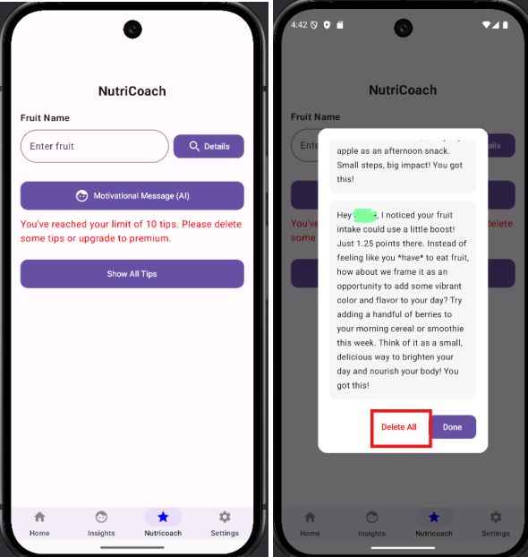
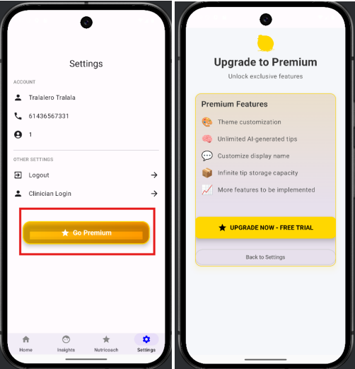
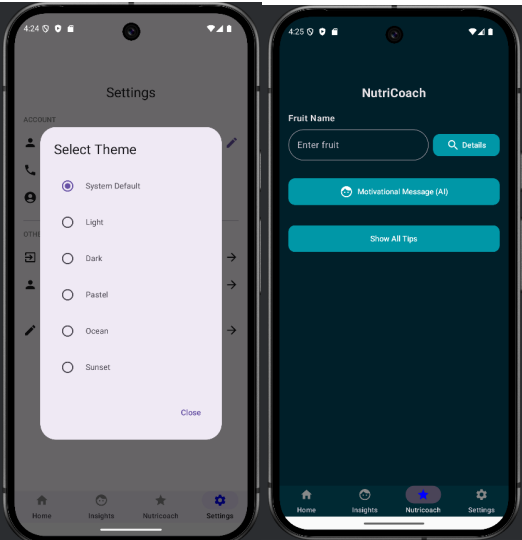
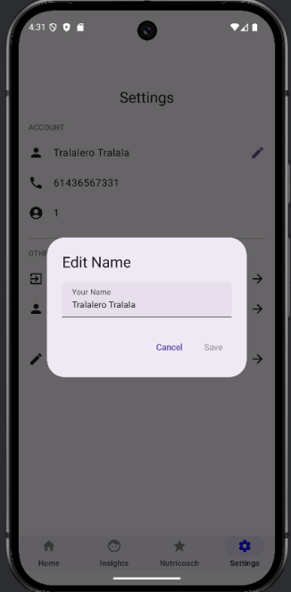

# NutriTrack AI

An Android nutrition-tracking application developed in **Kotlin** using **Android Studio**, with AI-assisted personalised nutrition guidance powered by the **Gemini API**.

The application combines nutrition monitoring, user profile management, AI-generated recommendations, persistent tip storage, and a tiered premium-access system with customisable themes.

## Technologies

- **Language:** Kotlin
- **UI:** Jetpack Compose
- **Architecture:** MVVM
- **Database:** Room
- **AI Integration:** Gemini API
- **Development:** Android Studio, Git, GitHub

## Project Overview

NutriTrack helps users monitor their nutrition-related information and receive personalised AI-generated guidance.

The application supports user-specific data management, nutrition insights, saved AI recommendations, profile settings, and additional premium functionality.

The project was originally developed as part of **FIT2081 Mobile Application Development at Monash University** and has been reorganised as a portfolio project.

## Key Features

### AI-Powered Nutrition Guidance

NutriTrack integrates the Gemini API to generate personalised nutrition and motivational recommendations based on user information.

The AI functionality includes:

- Personalised nutrition tips
- AI-generated motivational messages
- User-specific prompt generation
- Loading and error-state handling
- Persistent storage of generated tips

The Gemini API key is loaded through local configuration and is not stored in the repository.

### Nutrition Tracking

The application provides functionality for storing and displaying nutrition-related user information.

Users can review their data and receive personalised feedback based on their recorded information.

### Persistent AI Tip Storage



Generated AI recommendations can be stored locally so users can revisit previous messages.

The application supports:

- Saving generated tips
- Viewing saved recommendations
- Managing stored messages
- Clearing saved tips when required

### Premium Access System



A custom premium-access system was implemented beyond the core project requirements.

Premium users receive access to additional functionality including:

- Unlimited AI-generated tips
- Unlimited saved-tip storage
- Display-name customisation
- Custom application themes

Free users have limited AI-tip generation and storage capacity.

This feature demonstrates conditional feature access and differentiated application behaviour based on user state.

### Theme Customisation



Premium users can customise the visual appearance of the application.

Available themes include multiple interface styles such as:

- Light
- Dark
- Pastel
- Ocean
- Additional custom themes

Theme selection is persisted and applied throughout the application.

### User Profile Customisation



Users with premium access can update their display name through the settings interface.

The application maintains user-specific preferences and profile information across sessions.


The Gemini integration is managed through dedicated classes including a `GenAIViewModel`, which coordinates AI requests and exposes application state to the UI.

## Gemini Integration

The Gemini model is accessed through Google's Generative AI client.

The API key is loaded from a local configuration file rather than being hard-coded into the source code.

Example local configuration:

```text
GEMINI_API_KEY=your_api_key_here
```

`local.properties` is excluded from version control to prevent credentials from being committed to GitHub.

## Running the Project

### Requirements

- Android Studio
- Android SDK
- Java Development Kit compatible with the project
- Gemini API key

### Setup

1. Clone the repository:

```bash
git clone https://github.com/joshuateo2306/nutritrack-ai.git
```

2. Open the project in Android Studio.

3. Create or edit the project's `local.properties` file.

4. Add your Gemini API key using the configuration expected by the application:

```text
GEMINI_API_KEY=your_api_key_here
```

5. Allow Gradle to synchronise project dependencies.

6. Run the application using an Android emulator or compatible Android device.